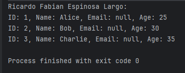

# **JDBC y Conexión a Bases de Datos Relacionales en Scala**
### AUTOR: RICARDO FABIAN ESPINOSA LARGO

## **¿Qué es JDBC y cuáles son sus componentes?**
JDBC (Java Database Connectivity) es una API de Java que permite interactuar con bases de datos relacionales utilizando el lenguaje SQL. JDBC actúa como un puente entre aplicaciones Java/Scala y sistemas de bases de datos.

### **Componentes principales de JDBC:**
1. **DriverManager**: Gestiona los controladores JDBC para establecer conexiones con bases de datos.
2. **Connection**: Representa una conexión física con la base de datos.
3. **Statement**: Permite ejecutar consultas SQL (tanto estáticas como dinámicas).
4. **ResultSet**: Representa los datos devueltos por una consulta SQL.
5. **PreparedStatement**: Una extensión de `Statement` que permite consultas parametrizadas y mejora el rendimiento.

---

## **Librerías en Scala para conectarse a bases de datos relacionales**

Scala proporciona varias librerías para interactuar con bases de datos. Aquí documentamos dos populares:

| **Librería**       | **Descripción**                                                                                     | **Ventajas**                                                                                      | **Desventajas**                                                                                     |
|---------------------|-----------------------------------------------------------------------------------------------------|---------------------------------------------------------------------------------------------------|-----------------------------------------------------------------------------------------------------|
| **doobie**          | Una librería funcional basada en `cats-effect` para trabajar con JDBC en Scala.                     | - Integración con `cats` y `fs2`. <br> - Permite consultas seguras en tiempo de compilación.       | - Requiere conocimiento de programación funcional.                                                  |
| **Slick**           | Un marco de mapeo objeto-relacional (ORM) que abstrae las consultas SQL con un enfoque funcional.   | - Abstracción de SQL. <br> - Soporte para bases de datos comunes. <br> - Generación de esquemas.  | - Menor control sobre las consultas SQL en comparación con JDBC puro o `doobie`.                    |

---

## **Cómo establecer una conexión a una base de datos relacional (MySQL)**

### **1. Generar una base de datos en MySQL**

```sql
-- AUTOR: RICARDO FABIAN ESPINOSA LARGO
DROP SCHEMA
    IF EXISTS base_prueba;
CREATE SCHEMA base_prueba COLLATE = utf8_general_ci;
USE base_prueba;

CREATE TABLE test_table (
                            id INT AUTO_INCREMENT PRIMARY KEY,
                            name VARCHAR(100) NOT NULL,
                            age INT NOT NULL
);

INSERT INTO test_table (name, age) VALUES
                                       ('Alice', 25),
                                       ('Bob', 30),
                                       ('Charlie', 35);
```
### **2. Agregar las dependencias en el archivo sbt de nuestro proyecto**
```scala
ThisBuild / version := "0.1.0-SNAPSHOT"

ThisBuild / scalaVersion := "2.23.11"

lazy val root = (project in file("."))
  .settings(
    name := "DataBaseConect",
    libraryDependencies ++= Seq(
      "mysql" % "mysql-connector-java" % "8.0.33",
      "org.typelevel" %% "cats-effect" % "3.5.2"
    )
  )
```
### **3. Ejecutar el codigo correspondiente**
```scala
import cats.effect.{IO, IOApp, Resource}
import java.sql.{Connection, DriverManager}

object coneccion extends App {
  // Función para crear una conexión a la base de datos
  def createConnection: Resource[IO, Connection] =
    Resource.make {
      IO {
        val url = "jdbc:mysql://127.0.0.1:3306/base_prueba" // URL de la base de datos
        val username = "root" // Usuario
        val password = "ricardo" // Contraseña
        DriverManager.getConnection(url, username, password) // Crear conexión
      }
    } { conn =>
      IO(conn.close()).handleErrorWith(_ => IO.unit) // Asegurar cierre seguro de la conexión
    }

  // Función principal que ejecuta las consultas a la base de datos
  def run: IO[Unit] = {
    createConnection.use { conn =>
      IO {
        val statement = conn.createStatement()
        val resultSet = statement.executeQuery("SELECT * FROM scala_test.users") // Consulta
        println("Ricardo Fabian Espinosa Largo:")
        while (resultSet.next()) {
          println(s"ID: ${resultSet.getInt("id")}, Name: ${resultSet.getString("name")}, Email: ${resultSet.getString("email")}, Age: ${resultSet.getInt("age")}")
        }
      }
    }
    run
  }
}
```

### **4. CAPTURA DE EJECUCION**
